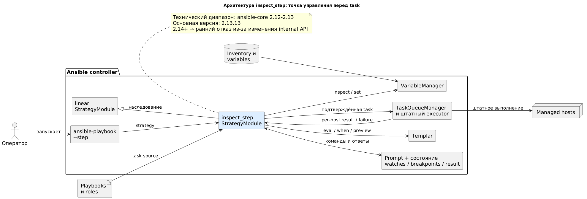

# «Боль»: printf-debugging вместо debugger

- В Ansible нет штатного интерактивного debugger уровня IDE: на практике диагностика часто превращается в `ansible.builtin.debug` + повторный запуск.
Типичный цикл диагностики:

```text
гипотеза → добавить debug → запустить playbook → найти нужный host
         → изменить debug → снова запустить → удалить debug
```

- Диагностические task временно попадают в playbook/role и могут остаться в коде.
- Для каждой новой гипотезы нужен новый запуск и повторное прохождение предыдущих task.
- Большие `hostvars` и facts создают шум; значения разных hosts трудно сопоставлять.
- Ошибка template, lookup, condition или variable precedence часто видна только в момент выполнения.
- После failed task стандартный play обычно уже не даёт исследовать и продолжить тот же сценарий.

# inspect_step - Интерактивная отладка Ansible playbooks

- `inspect_step` останавливает выполнение **до постановки task в очередь** и показывает её реальный host-контекст.
- Инженер может исследовать variables, Jinja, `when`, loop items, template и аргументы, а затем выполнить, пропустить или продолжить play.
- Решение не меняет executor Ansible: это controller-side strategy plugin поверх штатной `linear`.
- Техническая совместимость: **ansible-core 2.12–2.13**; основная протестированная версия: **2.13.13**.
- При запуске версия проверяется: ниже 2.12 выводится warning о partial compatibility, а 2.14+ отклоняется до вызова несовместимого API.
- Граница вызвана наследованием `linear.StrategyModule` и использованием internal hooks без стабильного public-контракта.
- Python должен поддерживаться выбранным выпуском `ansible-core`.

# Почему штатных механизмов недостаточно

- `ansible.builtin.debug` — печатает заранее выбранное значение, но требует изменения кода и перезапуска.
- `-vvv` — даёт подробный журнал executor, но не интерактивное состояние перед task.
- Обычный `--step` — спрашивает запуск/пропуск, но не позволяет исследовать variables, шаблоны и conditions.
- `--check --diff` — прогнозирует изменения только настолько хорошо, насколько это поддерживает конкретный модуль.
- Tags и `--start-at-task` — помогают навигации, но не дают breakpoint с просмотром runtime-контекста.

**Пробел:** нет единой точки, где можно остановиться перед task, задать несколько вопросов текущему контексту и только потом принять решение.

# Что делает и что не делает `inspect_step`

:::::::::::::: {.columns}
::: {.column width="50%"}
**Делает**

- Показывает source, hosts и runtime variables до выполнения task.
- Вычисляет expressions, `when`, args и template для выбранного loop item.
- Управляет run/run!/skip/go/continue, watches, breakpoints и result.
- Использует штатные `VariableManager`, `Templar` и executor Ansible.
:::
::: {.column width="50%"}
**Не делает**

- Не заменяет tests, `--check` и code review.
- Не является remote debugger и не обеспечивает rollback.
- Не выполняет loop пошагово по items.
- Не гарантирует безопасность lookup/plugins и не поддерживает ansible-core 2.14+.
:::
::::::::::::::

# Архитектура

:::::::::::::: {.columns}
::: {.column width="72%"}
{width=100%}
:::
::: {.column width="28%"}
- Plugin работает на controller; на managed hosts ничего не устанавливается.
- Наследование от `linear.StrategyModule` сохраняет lockstep-модель.
- Lookup/template остаются controller-side операциями.
:::
::::::::::::::

# Жизненный цикл одной task

1. `PlayIterator` и `linear` выбирают очередную lockstep-task и активные hosts.
2. `_take_step()` передаёт task в интерактивный inspector.
3. Inspector получает variables выбранного host и показывает masked source.
4. Оператор выполняет диагностические команды; task ещё не запущена.
5. `r`, `r!`, `s`, `g` или `c` определяют дальнейшее выполнение.
6. Разрешённая task идёт в штатный executor; результаты обрабатываются Ansible.
7. Inspector сохраняет per-host result и при необработанной ошибке открывает `inspect-failure>`.

**Архитектурный принцип:** отладчик наблюдает и управляет точкой допуска task, но не заменяет module executor.

# Карта команд

- **Выполнение:** `r/run`, `r!/run!`, `s/skip`, `c/continue`, `g/go`.
- **Контекст:** `w`, `hosts`, `h/help/?`.
- **Variables:** единая `vars/v/var`, выражения Jinja, явно немаскированные `vars!/v!/var!`, `set`.
- **Вычисления:** `e/eval`, `eval-all`, `eval-lookup`, `when`.
- **Preview:** `raw`, `args/args!`, `loop/loop!`, `loop eval/when/args/template`, `template`, `template-save`.
- **Состояние:** `result/result!`, `watch add/list/delete`.
- **Навигация:** `break task/role/tag`, `break list/delete`.
- **После failure:** `i/ignore`, `c/continue`, `a/abort`.

Суффикс `!` означает намеренно немаскированный вывод и требует осторожности; `r!` временно отключает task-level `no_log`.

# Интерактивная пауза перед выполнением task

Inspector приостанавливает controller до постановки текущей task в очередь и показывает её host-контекст:

```text
INSPECT TASK: application : Render configuration
Host: web01 (inspection host; task has 2 active hosts)

TASK SOURCE [.../roles/application/tasks/main.yml:24]
- name: Render configuration
  ansible.builtin.template:
    src: application.conf.j2
    dest: '{{ app_root }}/{{ app_name }}.conf'

inspect-step> vars app_config depth=2 host=web01
inspect-step> template web01
inspect-step> r
```

Команда `r` завершает интерактивную паузу и разрешает выполнение текущей task.

# Управление выполнением

```text
inspect-step> w
# повторно показать task после большого вывода variables

inspect-step> s
SKIP: application : Restart service

inspect-step> r
RUN: application : Configure service

inspect-step> r!
# выполнить выбранную task с task-level no_log: false

inspect-step> c
# выполнить текущую task и убрать обычные последующие остановки
```

```text
inspect-step> hosts
web01 (default inspection host, active for current task)
web02 (active for current task)
```

# Variables: точка, структура, host

```text
vars app_port                    # v и var — короткие alias
v app_config.workers depth=1
vars hostvars.ansible_facts host=web02
v glob=role_*                    # glob: * — любое количество символов
v glob=role_[ab]                 # [ab] — один из двух символов
vars regex=^(role|app)_[a-z0-9_]+$
var app_password | length       # фильтр Ansible
var app_config.workers + 2      # несколько значений

vars depth=1                     # первый уровень всего контекста
v ansible_facts host=web02 depth=2
vars! app_config host=web02 depth=3
v! app_config host=web02 depth=3 # без маскирования
```

- У неявно выбранного host имя всё равно отображается.
- JSON-строки со структурой форматируются как mappings/sequences.
- `vars`, `v` и `var` используют один parser; выражения вычисляются через Templar без lookups. Вычисленный скаляр может раскрыть секрет.
- `depth=N` ограничивает объём вывода относительно выбранного path.

# Временное изменение variable

```text
set app_port 9000
set feature_enabled true
set settings '{"workers": 4, "enabled": true}'
set app_port 9002 host=web02
```

- Без `host=` значение меняется для всех hosts play; с `host=` — для одного.
- Значение разбирается как YAML/JSON и существует только в текущем процессе.
- Это top-level override, а не постоянное изменение inventory или role.
- Extra vars (`-e`) и magic variables могут иметь более высокий precedence.
- Секрет, введённый через `set`, может остаться в readline history.

# Jinja, conditions и сравнение hosts

```text
eval {{ app_root }}/{{ app_name }}-{{ inventory_hostname }}.conf
eval {{ app_config.workers }} host=web02

eval-all {{ host_app_port }} diff=true
when all

watch add {{ app_port }}
watch add {{ app_root }}/{{ app_name }}.conf host=web02
```

- `eval`, `eval-all` и watches выполняют Jinja с отключёнными Ansible lookups.
- `eval-all` вычисляет выражение для hosts, активных у текущей task.
- `when` — preview; executor повторно вычислит condition при реальном запуске.
- Watch автоматически выводится на каждой следующей интерактивной остановке.

# Lookup: отдельная опасная операция

```text
eval-lookup {{ lookup('env', 'HOME') }} host=web01

eval-lookup {{ lookup('hashi_vault',
  hashicorp_vault_hashi_vault_path_root +
  (hashicorp_vault_cacertfile | basename)) }} host=web01
```

- Только один явно выбранный или default host; нет режима `all` и автоматических watches.
- Перед каждым вызовом выводится warning.
- Результат не маскируется.
- Lookup работает на controller и может читать файлы, запускать команды, обращаться к Vault/сети и иметь side effects.
- Preview и реальное выполнение могут вернуть разные значения и вызвать lookup дважды.

# Preview без выполнения task

```text
raw                              # исходные task.args
args                             # templated args, secrets masked
args!                            # templated args без masking

loop all depth=1                 # items и loop_control по hosts
loop eval 2 {{ item }} host=web01
loop when 2 host=web01
loop args 2 host=web01
loop template 2 host=web01
result all depth=2               # предыдущий result по hosts

template web01                   # результат template на экране
template-save /tmp/app.conf web01
```

- `template-save` пишет локальный файл на controller с mode `0600` и не перезаписывает существующий.
- Item-aware команды используют 1-based номер из loop preview, но не выполняют item.
- `loop` не даёт per-item step execution.
- Template, args и loop preview могут выполнить lookup, уже присутствующий в task/template.

# Breakpoints и переход `go`

```text
break task application
break task '^test_role : Render'
break role test_role
break tag inspect_demo
break list
g
```

- `break task` использует Python regexp и поиск `search`.
- Рекомендуется `break task application`.
- `break task *application*` — неверный regexp: `*` не может стоять первым.
- `break role` и `break tag` используют точное регистрозависимое совпадение.
- Совпавшая task останавливается **до** выполнения.

# Продолжение после failed task

```text
fatal: [web01]: FAILED! => {"msg": "missing required arguments: path"}

INSPECT FAILURE: application : Create directory
Failed host: web01
inspect-failure> i
```

- `i/ignore` — считать failure проигнорированным и сохранить step mode.
- `c/continue` — проигнорировать failure и убрать последующие обычные остановки.
- `a/abort` — сохранить стандартное failed-состояние Ansible.
- Решение относится к failures одной lockstep-task.
- Recovery не откатывает уже сделанные remote changes и не восстанавливает unreachable hosts.

# Безопасность и `--check`

- Masking эвристический: он не гарантирует обнаружение всех секретов.
- `v`, `eval*`, watches, `raw`, команды с `!` и template preview могут раскрыть чувствительные данные; `r!` также передаёт их callbacks и job logs.
- `--check` не является sandbox: `check_mode: false`, lookup/action plugins, caches и внешние сервисы могут иметь реальные эффекты.
- `changed` в check mode — прогноз модуля; неподдерживаемые модули могут skip task или вернуть неполный result.
- `s` не запускает task; `r`, `r!`, `g`, `c` сохраняют обычную семантику текущего check mode.
- Для production нужны те же права, аудит и ограничения доступа к controller, что и для обычного `ansible-playbook`.

<!--
Build PowerPoint:
python3 presentation/build_presentation.py
-->
